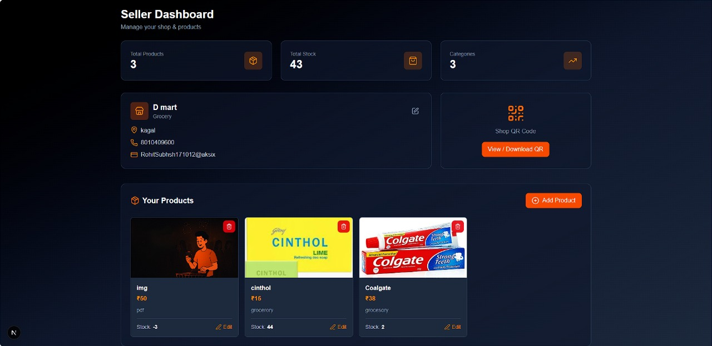

RetailIQ — AI-Powered Retail Platform (Active Development)

RetailIQ is an AI-driven retail management system built to transform seller operations. The platform currently supports all core flows—from authentication to cart management—and is expanding toward advanced analytics, full dashboards, and smart order fulfillment.

The project follows a modern monorepo architecture using Next.js 14, Node.js, and Firebase, ensuring clean, scalable development.

🚀 Current Progress
Frontend (Next.js 14)
Status	Feature
✅	Home Page
✅	Login Page
✅	Signup Page
✅	Cart Page (QR flow base)
✅	Auth Routing + Basic State Management
Backend (Node.js + Firebase)
Status	Feature
✅	Firebase Admin Configuration
✅	Login / Signup APIs
✅	Cart APIs
✅	QR Scanning API Base
🛠 In Progress & Upcoming Roadmap
Core Flow

Seller Dashboard

Product Listing & Inventory Management

Final QR → Cart → Order Journey

Advanced

Analytics Dashboard

Role-Based Access (Admin / Seller)

Order History & Customer Tracking

Payments Integration

Deployment

Frontend → Vercel

Backend → Firebase / Render

🧰 Tech Stack
Frontend

Next.js 14

React

TailwindCSS

ShadCN UI

Backend

Node.js

Express

Firebase Admin SDK

Firestore

📁 Project Structure
RetailIQ/
├── retailiqfrontend/       # Next.js 14 frontend application
├── retailiqbackend/        # Node.js + Express backend server
├── assets/                 # App screenshots and media
├── .gitignore
├── README.md

💻 Local Setup
1. Clone the Repository
git clone https://github.com/RohitKamble171012/RetailIQ.git
cd RetailIQ

2. Start the Frontend
cd retailiqfrontend
npm install
npm run dev

3. Start the Backend
cd retailiqbackend
npm install
npm start

📸 Screenshots
Home Page

Login Page

Signup Page

Dashboard Page

